# GUARDEN - Garden Urban AI Rodent Detection and Environment Node

**Seattle University - College of Science and Engineering**
**ECEGR 4640: Internet of Things (IoT)**

**Team:** Ezekiel Mitchell, Rollan Cabalar, Narely Rivas Castellon, Tony Tran, Brandon Vu
**Community Partner:** Danny Woo Community Garden (Liaison: Andy Allen, aallen@interimcda.org)

[](LICENSE)
[](https://www.espressif.com/en/products/socs/esp32-c3)
[](https://www.python.org/downloads/)

---

## Overview

The Danny Woo Community Garden (established 1975) is a 1.5-acre urban P-Patch serving Seattle's International District/Chinatown community. Rat infestations significantly reduce harvest yields. GUARDEN provides a data-driven solution using distributed AI-powered camera nodes to monitor and map rat activity, enabling targeted pest control.

### Key Features

- **Edge AI Detection** - On-device TensorFlow Lite inference on ESP32-C3
- **Low Power Operation** - Motion-triggered wake with deep sleep (10µA standby)
- **Privacy-First** - Metadata-only transmission, no images leave devices
- **Real-Time Monitoring** - Local web dashboard with live visualization
- **Data-Driven Insights** - Activity heatmaps, peak detection times, nesting area identification
- **Offline Operation** - Fully self-contained system with no internet dependency
- **Local Network** - Pi 3B+ acts as WiFi access point for ESP32 nodes and user access

---

## System Architecture

```mermaid
flowchart TB
    %% ============================================================================
    %% EDGE TIER - ESP32-C3 Detection Nodes
    %% ============================================================================
    subgraph EDGE[" "]
        direction TB
        EDGE_TITLE["<b>EDGE TIER</b><br/>ESP32-C3 Detection Nodes × 4<br/>━━━━━━━━━━━━━━━━━━━━"]

        subgraph NODE["Detection Node Processing Pipeline"]
            direction LR

            subgraph SENSE["Sensing"]
                PIR["PIR Sensor<br/><i>Motion Detection</i>"]
                CAM["OV2640 Camera<br/><i>640×480 RGB</i>"]
            end

            subgraph PROCESS["AI Processing"]
                RESIZE["Resize<br/><i>640×480→96×96</i>"]
                TFLITE["TensorFlow Lite<br/><i>INT8 Quantized</i>"]
                CONF{{"Confidence<br/>≥70%?"}}
            end

            subgraph ACTION["Action"]
                META["Build JSON<br/><i>timestamp, node_id</i><br/><i>confidence, location</i>"]
                SLEEP["Deep Sleep<br/><i>10µA</i>"]
                SD["Local Queue<br/><i>microSD</i>"]
            end

            PIR -->|"Wake"| CAM
            CAM --> RESIZE
            RESIZE --> TFLITE
            TFLITE --> CONF
            CONF -->|"Pass"| META
            CONF -->|"Fail"| SLEEP
            META --> SD
        end

        EDGE_OUT["MQTT Publish<br/><i>Topic: guarden/detections</i><br/><i>QoS 2</i>"]
        SD --> EDGE_OUT
    end

    %% ============================================================================
    %% SERVER TIER - Raspberry Pi 3B+ (All-in-One Local Server)
    %% ============================================================================
    subgraph SERVER[" "]
        direction TB
        SERVER_TITLE["<b>SERVER TIER</b><br/>Raspberry Pi 3B+ Local Server<br/>━━━━━━━━━━━━━━━━━━━━"]

        subgraph NETWORK["Network Services"]
            direction LR
            AP["WiFi Access Point<br/><i>SSID: GUARDEN-Local</i><br/><i>Offline Network</i>"]
            BROKER["MQTT Broker<br/><i>Mosquitto</i><br/><i>Port 1883</i>"]
        end

        subgraph DATA["Data Layer"]
            direction LR
            VALIDATE["Message Parser<br/><i>JSON Validation</i>"]
            DB[("PostgreSQL DB<br/><i>Local Storage</i><br/><i>Time-Series Data</i>")]
            ANALYTICS["Analytics Engine<br/><i>Pattern Detection</i><br/><i>Heatmap Generation</i>"]
        end

        subgraph WEB["Web Services"]
            direction LR
            API["REST API<br/><i>Flask/FastAPI</i><br/><i>Port 5000</i>"]
            WSOCK["WebSocket<br/><i>Live Updates</i>"]
            STATIC["Web Server<br/><i>Dashboard UI</i><br/><i>Port 80</i>"]
        end

        AP --> BROKER
        BROKER --> VALIDATE
        VALIDATE --> DB
        DB --> ANALYTICS
        ANALYTICS --> API
        DB --> API
        API --> STATIC
        WSOCK --> STATIC
    end

    %% ============================================================================
    %% CLIENT TIER - User Access
    %% ============================================================================
    subgraph CLIENT[" "]
        direction TB
        CLIENT_TITLE["<b>CLIENT TIER</b><br/>Local Device Access<br/>━━━━━━━━━━━━━━━━━━━━"]

        subgraph ACCESS["User Devices"]
            direction LR
            PHONE["Mobile Phone<br/><i>Connect to WiFi</i><br/><i>GUARDEN-Local</i>"]
            LAPTOP["Laptop/Tablet<br/><i>Browser Access</i><br/><i>http://192.168.4.1</i>"]
        end

        subgraph FEATURES["Dashboard Features"]
            direction LR
            DASH["Live Detection Feed<br/><i>Real-time Charts</i>"]
            HEATMAP["Activity Heatmap<br/><i>Location-based</i>"]
            EXPORT["Data Export<br/><i>CSV/JSON</i>"]
        end

        PHONE --> DASH
        LAPTOP --> DASH
        DASH --> HEATMAP
        DASH --> EXPORT
    end

    %% ============================================================================
    %% CONNECTIONS
    %% ============================================================================
    EDGE_OUT -.->|"Local WiFi<br/>No Internet"| AP
    STATIC -.->|"HTTP"| PHONE
    STATIC -.->|"HTTP"| LAPTOP

    %% ============================================================================
    %% STYLING
    %% ============================================================================
    classDef edgeTier fill:#e3f2fd,stroke:#1565c0,stroke-width:3px,color:#000
    classDef serverTier fill:#fff3e0,stroke:#ef6c00,stroke-width:3px,color:#000
    classDef clientTier fill:#f3e5f5,stroke:#6a1b9a,stroke-width:3px,color:#000
    classDef sensor fill:#c8e6c9,stroke:#2e7d32,stroke-width:2px,color:#000
    classDef process fill:#bbdefb,stroke:#0d47a1,stroke-width:2px,color:#000
    classDef decision fill:#ffccbc,stroke:#bf360c,stroke-width:2px,color:#000
    classDef storage fill:#d1c4e9,stroke:#4527a0,stroke-width:2px,color:#000
    classDef network fill:#b2dfdb,stroke:#00695c,stroke-width:2px,color:#000
    classDef client fill:#f8bbd0,stroke:#880e4f,stroke-width:2px,color:#000

    class EDGE edgeTier
    class SERVER serverTier
    class CLIENT clientTier
    class PIR,CAM sensor
    class RESIZE,TFLITE,META,VALIDATE,ANALYTICS,API process
    class CONF decision
    class SD,DB storage
    class EDGE_OUT,AP,BROKER,WSOCK,STATIC network
    class SLEEP,PHONE,LAPTOP,DASH,HEATMAP,EXPORT client
```



### Technical Specifications

| Component | Specification | Performance | Power |
|-----------|---------------|-------------|-------|
| **Processor** | ESP32-C3 RISC-V @ 160MHz | <250ms inference target | 240mA active |
| **Camera** | OV2640 2MP sensor | 640×480 capture | 80mA |
| **AI Model** | TensorFlow Lite INT8 | >90% accuracy target | 160mA |
| **Motion Sensor** | PIR sensor | Event-driven wake | 50µA standby |
| **Sleep Mode** | Deep sleep | Extended battery | 10µA |
| **Connectivity** | WiFi 802.11 b/g/n + MQTT | Reliable mesh | 120mA TX |
| **Storage** | MicroSD + PostgreSQL | Offline resilience | 20mA write |
| **Power** | Solar + 5000mAh LiPo | 10+ day runtime | Self-sustaining |

#### Performance Targets

| Metric | Target |
|--------|--------|
| Detection Latency | <250ms |
| Battery Life | 7+ days |
| Detection Accuracy | >90% |
| Network Uptime | >95% |
| Storage Capacity | 30+ days |

---

## Hardware Components

| Component | Quantity | Unit Cost | Total | Notes |
|-----------|----------|-----------|-------|-------|
| Grove Vision AI V2 Kit | 4 | - | - | Provided on campus |
| Raspberry Pi 3B+ | 1 | $35 | $35 | Local server + WiFi AP |
| MicroSD Card (64GB) | 1 | $12 | $12 | For Pi database |
| MicroSD Cards (32GB) | 4 | $8 | $32 | For ESP32 local queuing |
| LiPo Batteries (5000mAh) | 4 | $15 | $60 | 3.7V with protection |
| Miscellaneous | - | - | ~$110 | Wire, connectors, mounting, enclosures |

**Projected Total:** ~$250 (including taxes)

**Network Architecture:**
- **Pi 3B+:** WiFi Access Point (SSID: GUARDEN-Local) - creates local network
- **ESP32 Nodes:** Connect to Pi's WiFi AP for MQTT communication
- **User Devices:** Connect to Pi's WiFi AP to access web dashboard
- **No Internet Required:** Fully offline, self-contained system

**Power System:**
- **Hub (Pi 3B+):** Direct AC power or large power bank
- **Edge Nodes:** Solar panels + LiPo battery + backup

---

## Installation

### Prerequisites

**Hardware:**
- ESP32-C3 with camera module (Grove Vision AI V2 Kit) × 4
- Raspberry Pi 3B+ (local server with built-in WiFi)
- MicroSD cards (64GB for Pi, 32GB for each ESP32 node)
- LiPo batteries (5000mAh) and solar panels
- Weatherproof enclosures
- Power bank or AC adapter for Pi 3B+

**Software:**
- Raspberry Pi OS Lite (64-bit)
- Python 3.8+
- PlatformIO (ESP32 development)
- Mosquitto MQTT broker
- PostgreSQL 13+
- Nginx (web server)
- hostapd (WiFi access point software)

### Quick Start

```bash
# ============================================================
# RASPBERRY PI 3B+ SETUP (Local Server)
# ============================================================

# 1. Setup WiFi Access Point
sudo apt-get update
sudo apt-get install hostapd dnsmasq

# Configure hostapd for WiFi AP
sudo nano /etc/hostapd/hostapd.conf
# Add:
#   interface=wlan0
#   ssid=GUARDEN-Local
#   hw_mode=g
#   channel=7
#   auth_algs=1
#   wpa=2
#   wpa_passphrase=guarden2024
#   wpa_key_mgmt=WPA-PSK

# Configure static IP
sudo nano /etc/dhcpcd.conf
# Add:
#   interface wlan0
#   static ip_address=192.168.4.1/24
#   nohook wpa_supplicant

# 2. Install system dependencies
sudo apt-get install postgresql mosquitto nginx python3-pip

# 3. Setup MQTT Broker
sudo systemctl enable mosquitto
sudo systemctl start mosquitto

# 4. Setup PostgreSQL database
sudo -u postgres createdb guarden
sudo -u postgres psql -c "CREATE USER guarden WITH PASSWORD 'guarden';"
sudo -u postgres psql -c "GRANT ALL PRIVILEGES ON DATABASE guarden TO guarden;"

# 5. Clone and setup GUARDEN
git clone https://github.com/ezekielmitchell/GUARDEN.git
cd GUARDEN

# 6. Install Python backend
cd src/fog/python_service
pip3 install -r requirements.txt
python3 init_db.py

# 7. Setup web dashboard
cd ../../web
sudo cp -r build/* /var/www/html/

# 8. Start services
sudo systemctl enable guarden-backend
sudo systemctl start guarden-backend
sudo systemctl restart nginx

# ============================================================
# ESP32-C3 NODE SETUP (Detection Nodes)
# ============================================================

# 1. Configure WiFi credentials in firmware
cd src/edge/firmware
nano include/config.h
# Set:
#   WIFI_SSID = "GUARDEN-Local"
#   WIFI_PASSWORD = "guarden2024"
#   MQTT_SERVER = "192.168.4.1"

# 2. Flash ESP32 firmware (requires PlatformIO)
pio run --target upload

# ============================================================
# ACCESS THE SYSTEM
# ============================================================

# 1. Connect your phone/laptop to WiFi network "GUARDEN-Local"
# 2. Open browser and navigate to: http://192.168.4.1
# 3. View live detections, heatmaps, and analytics
```

---

## Project Structure

```
GUARDEN/
├── src/
│   ├── edge/              # ESP32 firmware and edge detection
│   ├── fog/               # Raspberry Pi hub services
│   └── web/               # Web dashboard and API
├── tests/                 # Unit and integration tests
├── data/                  # Datasets and trained models
├── scripts/               # Training, deployment, utilities
├── hardware/              # BOM, assembly guides, enclosures
├── docs/                  # Documentation
└── config/                # Configuration files
```

---

## Usage

### Deploying Detection Nodes

```bash
# 1. Configure node settings
vim config/edge_config.json

# 2. Flash firmware
scripts/deployment/flash_firmware.sh

# 3. Verify connectivity
mosquitto_sub -t 'guarden/#' -v
```

### Accessing the Dashboard

The local web dashboard provides:
- Real-time detection timeline with live updates
- Activity heatmap by camera location
- Peak hours analysis and pattern detection
- System health monitoring (battery levels, connectivity)
- Historical data visualization

**Access Steps:**
1. Connect your device (phone/laptop/tablet) to WiFi network `GUARDEN-Local`
2. Password: `guarden2024`
3. Open browser and navigate to: `http://192.168.4.1`
4. No internet connection required - fully offline operation

### Exporting Data

```bash
python scripts/utilities/export_data.py --start-date 2025-11-01 --end-date 2025-11-07
```

Data exports as CSV for analysis.

### Generating Reports

```bash
python scripts/utilities/generate_report.py --period weekly
```

Generates PDF reports with activity zones, peak times, and pest control recommendations.

---

## Model Training

### Training Pipeline

```bash
# Prepare dataset
python scripts/training/prepare_dataset.py

# Train model
python scripts/training/train_model.py --epochs 50 --batch-size 32

# Convert to TensorFlow Lite
python scripts/training/convert_to_tflite.py --model-path models/rat_detector.h5

# Evaluate performance
python scripts/training/evaluate_model.py --model-path models/rat_detector.tflite
```

**Model Requirements:**
- Input: 96×96 RGB image
- Output: Confidence score (0-100%)
- Threshold: ≥70%
- Quantization: INT8 for ESP32 compatibility

Models stored in `data/models/` and deployed to `src/edge/tflite_models/`.

---

## Testing

```bash
# Run all tests
pytest tests/

# Test by tier
pytest tests/edge/      # Edge tier
pytest tests/fog/       # Fog tier
pytest tests/web/       # Web tier
pytest tests/integration/  # Integration tests

# Test coverage
pytest --cov=src tests/
```

---

## Development Timeline

| Phase | Start | End | Deliverable | Status |
|-------|-------|-----|-------------|--------|
| Order Components | ASAP | 10/28/2025 | Hardware acquired | ⏳ In Progress |
| Hardware Systems | 10/28/2025 | 11/11/2025 | Assembled nodes | 📋 Planned |
| AI Detection Model | 10/28/2025 | 11/11/2025 | Trained model | 📋 Planned |
| Web Dashboard | 10/28/2025 | 11/11/2025 | Live dashboard | 📋 Planned |
| Finished Prototype | 10/28/2025 | 11/11/2025 | Working prototype | 📋 Planned |
| On-site Preparation | 11/11/2025 | 11/25/2025 | Site survey | 📋 Planned |
| Field Testing | 11/25/2025 | 12/01/2025 | System validation | 📋 Planned |
| Field Deployment | 12/05/2025 | 12/05/2025 | Live deployment | 📋 Planned |
| Documentation | 12/05/2025 | 12/09/2025 | Complete docs | 📋 Planned |
| Final Presentation | 12/10/2025 | 12/10/2025 | Results | 📋 Planned |

---

## Team

**Students:**
- Ezekiel Mitchell (@ezekielmitchell) - AI Detection Model
- Rollan Cabalar - Web Dashboard & Backend
- Narely Rivas Castellon - On-site Preparation
- Tony Tran - On-site Preparation
- Brandon Vu - On-site Preparation

**Community Partner:**
- Danny Woo Community Garden
- Liaison: Andy Allen (aallen@interimcda.org)

---

## Documentation

- [System Architecture](docs/technical/architecture.md)
- [API Reference](docs/technical/api_reference.md)
- [Hardware Specifications](docs/technical/hardware_specs.md)
- [Dashboard User Guide](docs/user_guides/dashboard_guide.md)
- [Maintenance Procedures](docs/user_guides/maintenance.md)
- [Troubleshooting Guide](docs/user_guides/troubleshooting.md)

---

## References

1. Jaulin, Edouard. "Rapport 2024." ENSTA Bretagne (2024).
2. Leu Mei Xin, & Nik Fadzly N Rosely. Development of Machine Learning Wildlife Camera Using ESP32 CAM for Small Mammals. Pertanika Journal of Science & Technology (2025).
3. Rithik Krisna. ESP32 cam based Object Detection & Identification using Edge Impulse. Circuit Digest (2024).

---

## License

This project is licensed under the MIT License - see the [LICENSE](LICENSE) file for details.

---

## Acknowledgments

- Seattle University College of Science and Engineering
- Danny Woo Community Garden and its dedicated staff
- The International District/Chinatown community
- ECEGR 4640 course instructors

---

## Contact

**Project Repository:** https://github.com/ezekielmitchell/GUARDEN
**Team Email:** emitchell4@seattleu.edu
