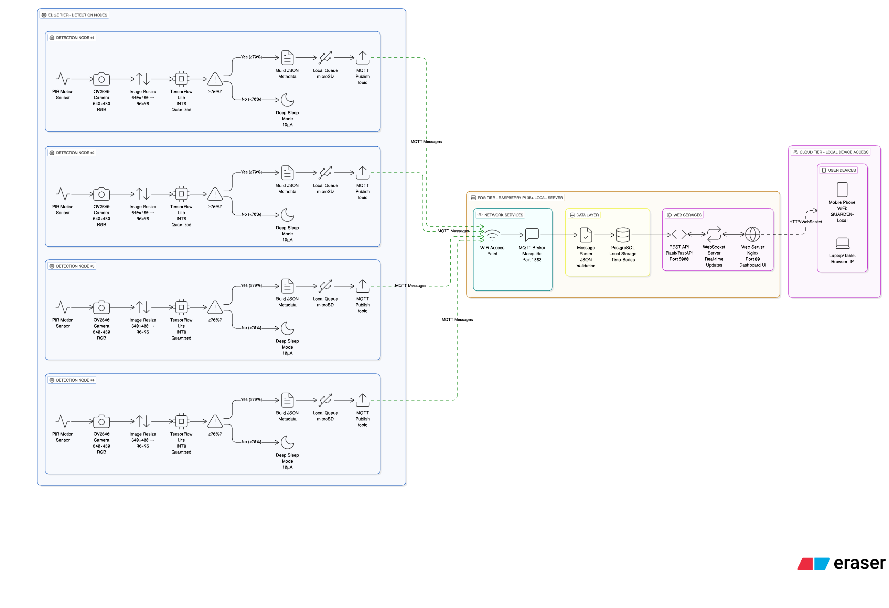

---
layout:
  width: wide
  title:
    visible: true
  description:
    visible: true
  tableOfContents:
    visible: true
  outline:
    visible: true
  pagination:
    visible: true
  metadata:
    visible: true
---

# System Architecture

<figure><picture><source srcset=".gitbook/assets/guarden_dark.png" media="(prefers-color-scheme: dark)"></picture><figcaption>
image [2] system_overview
</figcaption></figure>

## Hardware Components

<table data-full-width="false"><thead><tr><th>Name/Part</th><th>Quantity</th><th>Description/Role</th><th>Where Used</th><th>Notes</th><th>Manufacturer/Source</th></tr></thead><tbody><tr><td>Raspberry Pi 4</td><td>1</td><td>Central hub/controller</td><td>Hub</td><td>Main system, runs server</td><td>Raspberry Pi</td></tr><tr><td>ESP32-CAM</td><td>3</td><td>Vision edge nodes</td><td>Edge node</td><td>Camera + WiFi</td><td>Espressif</td></tr><tr><td>Grove Vision AI Module</td><td>3</td><td>On-device inference</td><td>Edge node</td><td>Model runs on-node</td><td>Seeed Studio</td></tr><tr><td>LiPo Battery (7.4V, 2Ah)</td><td>4</td><td>Power supply</td><td>Hub + edge nodes</td><td>Rechargeable, solar input</td><td>Adafruit/Generic</td></tr><tr><td>Solar Panel (10W)</td><td>3</td><td>Provides power to edge nodes</td><td>Edge node</td><td>For off-grid operation</td><td>[Supplier]</td></tr><tr><td>MicroSD Card 32GB</td><td>2</td><td>Storage for PI/ESP32</td><td>Hub, vision nodes</td><td>OS + logs/data</td><td>SanDisk</td></tr><tr><td>Power Bank (20,000mAh)</td><td>1</td><td>Backup power</td><td>Hub</td><td>For AC power outage</td><td>Anker/Generic</td></tr></tbody></table>

**Network Architecture:**

* **Pi 3B+:** WiFi Access Point (SSID: GUARDEN-Local) - creates local network
* **ESP32 Nodes:** Connect to Pi's WiFi AP for MQTT communication
* **User Devices:** Connect to Pi's WiFi AP to access the web dashboard
* **No Internet Required:** Fully offline, self-contained system

**Power System:**

* **Hub (Pi 3B+):** Direct AC power or large power bank
* **Edge Nodes:** Solar panels + LiPo battery

## Software Tools & Stack

<table data-full-width="false"><thead><tr><th>Name</th><th>Version</th><th>Purpose/Role</th><th>Location</th><th>Notes/Links</th></tr></thead><tbody><tr><td>Raspberry Pi OS</td><td>[version]</td><td>Main operating system</td><td>Raspberry Pi Hub</td><td>[Official site]</td></tr><tr><td>Python</td><td>[version]</td><td>Scripting, automation</td><td>Raspberry Pi, cloud</td><td>Used for control logic</td></tr><tr><td>OpenCV</td><td>[version]</td><td>Computer vision processing</td><td>Pi, vision nodes</td><td>For image/video tasks</td></tr><tr><td>MQTT (Mosquitto)</td><td>[version]</td><td>Messaging protocol broker</td><td>Hub, edge nodes</td><td>Device comms</td></tr><tr><td>ESP-IDF/Arduino</td><td>[version]</td><td>Microcontroller firmware</td><td>ESP32 vision nodes</td><td>Camera/sensor interfaces</td></tr><tr><td>Flask/FastAPI</td><td>[version]</td><td>Local web server/UI</td><td>Raspberry Pi Hub</td><td>API/dashboard</td></tr><tr><td>Grove AI Lib</td><td>[version]</td><td>Vision AI kit driver</td><td>ESP32 vision nodes</td><td>For running edge models</td></tr><tr><td>Node-RED</td><td>[version]</td><td>Visual programming</td><td>(optional, for rapid prototyping)</td><td></td></tr><tr><td>Dashboard UI</td><td>[name]</td><td>User control/monitoring</td><td>Any device browser</td><td>Local network only</td></tr></tbody></table>

## Network Architecture

## Power Systems

## Bills of Materials (BOM)

| Name/Part           | Description/Role           | Manufacturer/Developer | Quantity/License | Unit Cost | Total Cost | Notes/Links     |
| ------------------- | -------------------------- | ---------------------- | ---------------- | --------- | ---------- | --------------- |
| Raspberry Pi 4      | Central Controller         | Raspberry Pi           | 1                | $60       | $60        | \[Official]     |
| ESP32-CAM           | Vision Node                | Espressif              | 3                | $9        | $27        | \[Datasheet]    |
| OpenCV              | Computer vision library    | OpenCV                 | Open Source      | Free      | Free       | \[Docs]         |
| Grove Vision AI Kit | Edge inference module      | Seeed Studio           | 3                | $35       | $105       | \[Product page] |
| Python              | Scripting language         | Python Foundation      | Open Source      | Free      | Free       | \[Python.org]   |
| MQTT (Mosquitto)    | Messaging protocol broker  | Eclipse Foundation     | Open Source      | Free      | Free       | \[Docs]         |
| Flask/FastAPI       | Local API server framework | Open Source            | Open Source      | Free      | Free       | \[Docs]         |
| Raspberry Pi OS     | OS for hub/controller      | Raspberry Pi           | Open Source      | Free      | Free       | \[Docs]         |
| LiPo Battery (7.4V) | Power supply               | Adafruit               | 4                | $20       | $80        |                 |
| Solar Panel (10W)   | Edge node power            | \[Supplier]            | 3                | $27       | $81        |                 |
| Power Bank          | Backup power (hub)         | Anker                  | 1                | $30       | $30        |                 |
